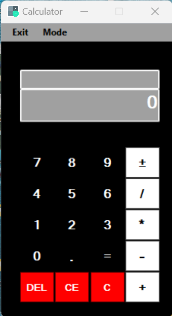

# All-in-One-Scientific-Calculator-Converter
Developed a desktop application for performing scientific calculations and unit conversions. Implemented multiple mathematical operations and conversion functionalities through a user-friendly interface

## Screenshot

## How to Run
1. Clone this repository
2. Open `Calculator.sln` in Visual Studio
3. Press F5 to run the application
